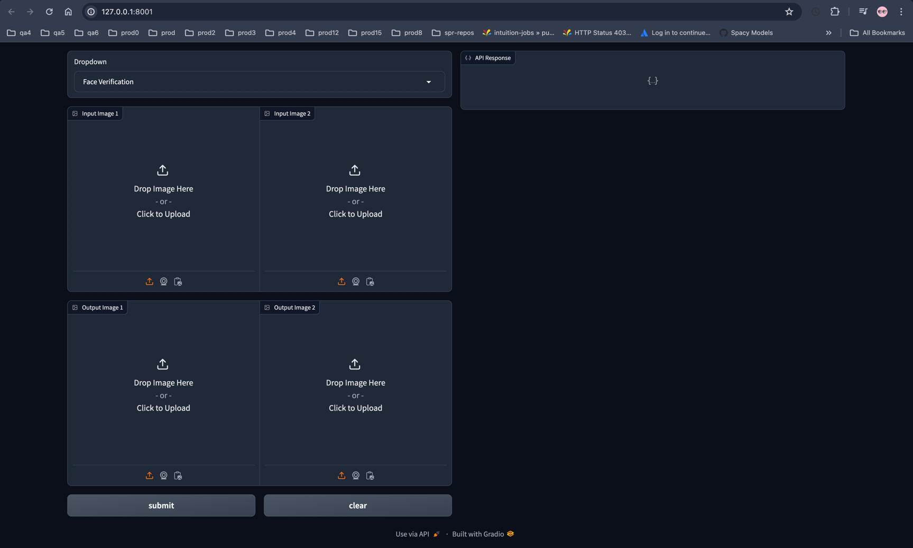

# FaceTrace
Face Recognition Project

### How to run service via docker compose:

---
- clone the repo in some local directory
- creating docker image:
  ```
  cd /FaceTrace
  docker build -t facetrace/facenet:latest -f ./dockerfile .
  ```
- create `.env` file in the same directory where `docker-compose.yaml` is present.
  one need to set following environment variable in `.env` file
  ```
  DOCKER_TAG=facetrace/facenet:latest

  DATABASE_PATH=<path/to/image database>

  APP_CONFIG_PATH=<path/to/app config.yaml>

  HOST_PATH=<host file system path>

  MOUNT_PATH=<container file system path>

  API_URL=<URL of the API, in case one want to use playground>
  ```
  Following the meaning of each environment variable

   - `DOCKER_TAG`: docker image which was built in second step.
   - `DATABASE_PATH`: container file system path where images and its related metadata will be stored
     
      - Following will be structure of the database
      ```bash
      <DATABASE_PATH>
      ├── database
      │   ├── metadata.json
      │   ├── images
      │   │   ├── user_01
      │   │   │   ├── image_01.jpeg
      │   │   │   ├── image_02.jpeg
      │   │   ├── user_02
      │   │   │   ├── image_01.jpeg
      ```
     `metadata.json`: this file is optional in case if it is missing. This file is used by the index 
      to store the precalculated embeddings.
      if when service is started, and it find images folder in database folder, then it will automatically
      calculate the embeddings of images and create `metadata.json` by itself
-  Once `./env` is created, then just run `docker-compose up`

Once all the service are up, once can access the playground UI to make sample curls to the service.
example:



### API Contract

---

Face Recognition API support following endpoints:
1. `/face-detect`: detects the bounding box of facial area in the input image
2. `/represent`: detects the facial areas input image and its corresponding embeddings
3. `/verity`: given 2 images in inputs, it verifies if both are matching or not.
4. `/add`: api maintain an image store, in which client can add new images which will be used later for recognition purpose.
5. `/recognize`: for given input, it will try to verify it with existing image in image store
6. `/re-index`: it will re index all the images in database

Following are the request response payload for each endpoint

- Request

    - `/face-detect`, `/represent`, `/recognize`
        ```
        {
          "payloads": [
            {
              "image": "<base64_encoded_image_string>"
            },
            {
              "image": "<base64_encoded_image_string>"
            }
          ]
        }
        ```
    - `/verify`
        ```
        {
          "payloads": [
            {
              "image1": "<base64_encoded_image_string>",
              "image2": "<base64_encoded_image_string>",
            },
            {
              "image1": "<base64_encoded_image_string>",
              "image2": "<base64_encoded_image_string>",
            }
          ]
        }
        ```
    - `/add`
       ```
        {
          "payloads": [
            {
              "image": "<base64_encoded_image_string>",
              "userId": "<Unique id of the user>"
            },
            {
              "image": "<base64_encoded_image_string>",
              "userId": "<Unique id of the user>"
            }
          ]
        }
        ```
      

- Response

    - `/face-detect`, `/represent`
        ```
        {
          "results": [
            {
              "faces": [
                {
                  "x": 0,
                  "y": 0,
                  "w": 250,
                  "h": 250,
                  "confidence": 0.99,
                  "left_eye": (25, 125),
                  "right_eye": (100, 145),
                  "embedding": [0.2, 0.4, 0.5] # only when endpoint is /represent
                }
              ]
            },
            {
              "faces": [
                {
                  "x": 0,
                  "y": 0,
                  "w": 250,
                  "h": 250,
                  "conf": 0.99,
                  "left_eye": (25, 125),
                  "right_eye": (100, 145),
                  "embedding": [0.2, 0.4, 0.5] # only when endpoint is /represent
                }
              ]
            }
          ]
        }
        ```
    - `/add`
        ```
        {
          "results": [
            {
              "success": True
            },
            {
              "success": False,
              "reason": "trying to add duplicate image. image file "
            }
          ]
       }
       ```
    - `/verify`
       ```
       {
         "results": [
           {
             "verified": true,
             "distance": 0.83,
             "metric": "cosine_similarity",
             "threshold": 0.6,
             "embedding_model": "FaceNet512",
             "detector_model": "FastMtcnn",
             "faces": {
               "image1": {
                 "x": 0,
                 "y": 0,
                 "w": 250,
                 "h": 250,
                 "confidence": 0.99,
                 "left_eye": (25, 125),
                 "right_eye": (100, 145),
               },
               "image2": {
                 "x": 0,
                 "y": 0,
                 "w": 250,
                 "h": 250,
                 "conf": 0.99,
                 "left_eye": (25, 125),
                 "right_eye": (100, 145),
               }
             }
           }
         ]
      }
      ```
    - `/recognize`
      ```
      {
        "results": [
          {
            "verified": true,
            "distance": 0.83,
            "metric": "cosine_similarity",
            "threshold": 0.6,
            "embedding_model": "FaceNet512",
            "detector_mode": "FastMtcnn",
            "userId": "<Unique Id of the user of matched>"
          }
        ]
      }
      ```
      
### CURLs

- add face to image store:
  ```
    curl --request POST \
    --header "Content-Type: application/json" \
    --url "http://0.0.0.0:8000/add"  \
    -d '{
      "payloads": [
        {
          "image": "<base64_encoded_image_string>",
          "userId": "test_user"
        }
      ]
    }'
  ```
  
- Recognize face already added face
  ```
    curl --request POST \
    --header "Content-Type: application/json" \
    --url "http://0.0.0.0:8000/recognize"  \
    -d '{
      "payloads": [
        {
          "image": "<base64_encoded_image_string>"
        }
      ]
    }'
  ```
  
- Detect face boundaries 
  ```
    curl --request POST \
    --header "Content-Type: application/json" \
    --url "http://0.0.0.0:8000/face-detect"  \
    -d '{
      "payloads": [
        {
          "image": "<base64_encoded_image_string>"
        }
      ]
    }'
  ```
  
- Verify if two images contains same face
  ```
    curl --request POST \
    --header "Content-Type: application/json" \
    --url "http://0.0.0.0:8000/verify"  \
    -d '{
      "payloads": [
        {
          "image1": "<base64_encoded_image_string>",
          "image2": "<base64_encoded_image_string>"
        }
      ]
    }'
  ```
  
  - re index all the images
  ```
    curl --request POST \
    --header "Content-Type: application/json" \
    --url "http://0.0.0.0:8000/re-index"'
  ```